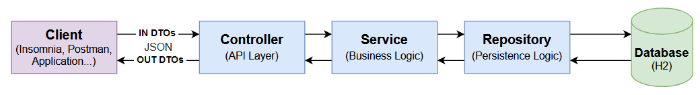
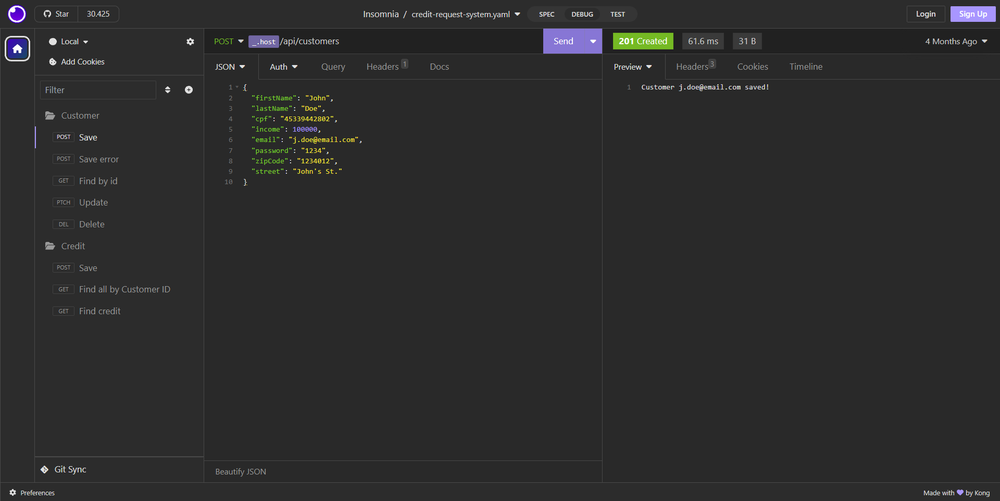

<h1 align="center" name="credit-request-system-api">Credit Request System API</h1>

<p align="center">Rest API created for a fictitious lending company where the objective is to manage customers and credit requests.</p>

<p align="center">
     <a alt="Java">
        
    </a>
    <a alt="Kotlin">
        
    </a>
    <a alt="Spring Boot">
        
    </a>
    <a alt="Gradle">
        
    </a>
    <a alt="H2 ">
        
    </a>
    <a alt="Flyway">
        
    </a>
</p>

<details>
  <summary>Table of Contents</summary>
  <ol>
    <li>
      <a href="#concept">Concept</a>
      <ul>
        <li><a href="#business-rules">Business rules</a></li>
        <li><a href="#database-model">Database model</a></li>
        <li><a href="#project-architecture">Project architecture</a></li>
      </ul>
    </li>
    <li>
      <a href="#getting-started">Getting Started</a>
      <ul>
        <li><a href="#prerequisites">Prerequisites</a></li>
        <li><a href="#installation">Installation</a></li>
        <li><a href="#how-to-run">How to run</a></li>
      </ul>
    </li>
    <li><a href="#collection">Collection</a></li>
    <li><a href="#references">References</a></li>
  </ol>
</details>

## Concept
In addition to **customer management**, the system must be able to perform a **new credit request**, **list all credit requests for a given customer** and **detail a specific credit request**.

### Business rules
- Number of installments must be between 1 and 48.
- Max day of first installment is 3 months in the future from today.
- Only the client who request the credit can get credit request details.

### Database model
The entity relation that determines the logical structure of a database.


## Project architecture
The project is organized in a three layers architecture.


## Getting Started

### Prerequisites
Get [Java17](https://www.oracle.com/java/technologies/javase/jdk17-archive-downloads.html) installed in your environment.

**Important**: Make sure that your _JAVA_HOME_ environment variable is correctly exported

### Installation

1. Clone the repo:
```sh
git clone https://github.com/barreto/credit-request-system
```

2. Enter the application directory:
```sh
cd credit-request-system
```

3. Set the database environment variables
```
    db_username=<username>
    db_password=<password>
```
Both of these variables will be used for the H2, an inmemory database, so you don't need to configure it.

### How to run
Using inproject gradle:
```sh
./gradlew bootRun
```

## Collection
Download and import the collection file in your Insomnia to enjoy this API.

[
    
    
](https://github.com/barreto/credit-request-system/blob/main/docs/credit-request-system-insomnia-collection_2023-04-27)

## References
- **Thanking**: This project was created during a [DIO](https://web.dio.me/home) bootcamp.

- **Original repository**: [credit-application-system](https://github.com/cami-la/credit-application-system) by [Camila Cavalcante](https://github.com/cami-la).

- **Initial structure**: This project start with configurations that can be loaded on [spring initializr link](https://start.spring.io/#!type=gradle-project&language=kotlin&platformVersion=3.0.6&packaging=jar&jvmVersion=17&groupId=me.dio&artifactId=credit-request-system&name=credit-request-system&description=System%20Spring%20Boot%20API%20for%20Credit%20Request&packageName=me.dio.credit-request-system&dependencies=web,data-jpa,validation,flyway,h2).

<p align="right"><a href="#credit-request-system-api">back to top ↑</a></p>